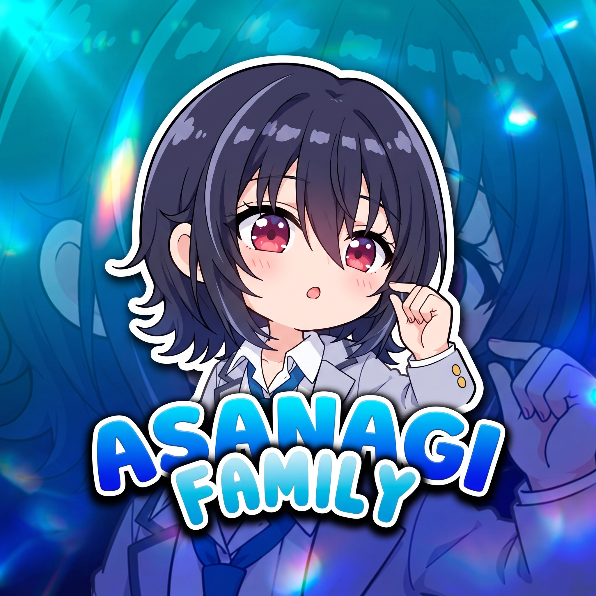

<p align="center">
  
</p>

<h1 align="center">🌸 ASANAGI MD 🌸</h1>

<p align="center">
  <b>Smart • Cute • Powerful WhatsApp Bot</b>
</p>

<p align="center">
  <i>Anime style WhatsApp Multi-Device Bot dengan sistem plugin fleksibel.</i>
</p>

<p align="center">
  
  
  
</p>

<p align="center">
  
  
  
</p>

---

## 🌸 Tentang Asanagi MD

**Asanagi MD** adalah WhatsApp Bot modern bertema anime yang dibuat untuk membantu kebutuhan grup, personal, hiburan, downloader, AI, hingga tools otomatisasi.

Bot ini menggunakan sistem plugin yang ringan, rapi, dan mudah dikembangkan ulang sesuai kebutuhan.

> 🌙 **Recode by Kurumi by hilman**  
> ✨ Dikembangkan ulang dengan tema **Asanagi MD** oleh **rafzzzaza**

---

## ✨ Highlight

- 🌸 Tampilan bot bertema **Asanagi Anime Style**
- 🤖 AI Chat & Auto Response
- 🎵 Downloader musik dan video
- 📥 TikTok, Instagram, YouTube Downloader
- 👥 Tools admin dan manajemen grup
- 🎮 Game, fun menu, dan RPG ringan
- 🖼️ Sticker, image tools, dan maker
- ⚙️ Sistem plugin fleksibel
- 🚀 Ringan, cepat, dan cocok untuk VPS

---

## 📦 Features

| Category | Description |
|---|---|
| 🤖 AI | Chat AI, auto reply, AI tools |
| 🎵 Downloader | YouTube, TikTok, Instagram, media downloader |
| 👥 Group | Welcome, hidetag, tagall, anti-link, admin tools |
| 🎮 Game | Tebak-tebakan, RPG, fun games |
| 🖼️ Sticker | Sticker maker, smeme, brat, to sticker |
| 🛠️ Tools | To URL, screenshot web, shortlink, converter |
| 👑 Owner | Eval, broadcast, backup, control bot |

---

## 🚀 Installation

```bash
git clone https://github.com/rafzzzaza/asanagi-md.git
cd asanagi-md
npm install
npm start
```

---

## ⚙️ Configuration

Edit bagian `config.js dan main js`, lalu sesuaikan owner dan pengaturan bot.

```js
global.owner = [['6283873043770', 'rafzzzaza', true]]
global.mods = []
global.prems = []

global.namebot = 'Asanagi AI'
global.author = 'rafzzzaza'
global.wm = '❀ ᴀsᴀɴᴀɢɪ ᴍᴅ ❀'
```

---

## 🧩 Plugin System

Simpan plugin di folder:

```bash
/plugins
```

Contoh struktur plugin:

```js
let handler = async (m, { conn, text, usedPrefix, command }) => {
  m.reply('Waku waku~ Asanagi siap membantu!')
}

handler.help = ['asanagi']
handler.tags = ['main']
handler.command = /^asanagi$/i

export default handler
```

---

## 🌸 Preview Style

```txt
╭─「 ASANAGI MD 」
│ Haii, aku Asanagi~ 🌸
│ Smart, cute, dan siap bantu grup kamu!
╰───────────────
```

---

## 🙏 Special Thanks

- Allah SWT
- My Parents
- rafzzzaza
- ryyn dev rin-md
- Nugraha
- Andik
- Hilman
- Kano
- kaaofc
- Joybee
- Kurumi MD
- AgusXzz
- ChiiMD
- Semua creator plugin
- Teman-teman yang selalu support ❤️

---

## 📌 Notes

Bot ini dibuat untuk pembelajaran dan pengembangan pribadi.  
Gunakan dengan bijak, jangan spam, dan jangan diperjualbelikan tanpa izin.

---

<p align="center">
  <b>🌸 Asanagi MD — Cute Outside, Powerful Inside 🌸</b>
</p>

<p align="center">
  <i>Recode by Kurumi • Theme by Asanagi MD • Created by rafzzzaza</i>
</p>
